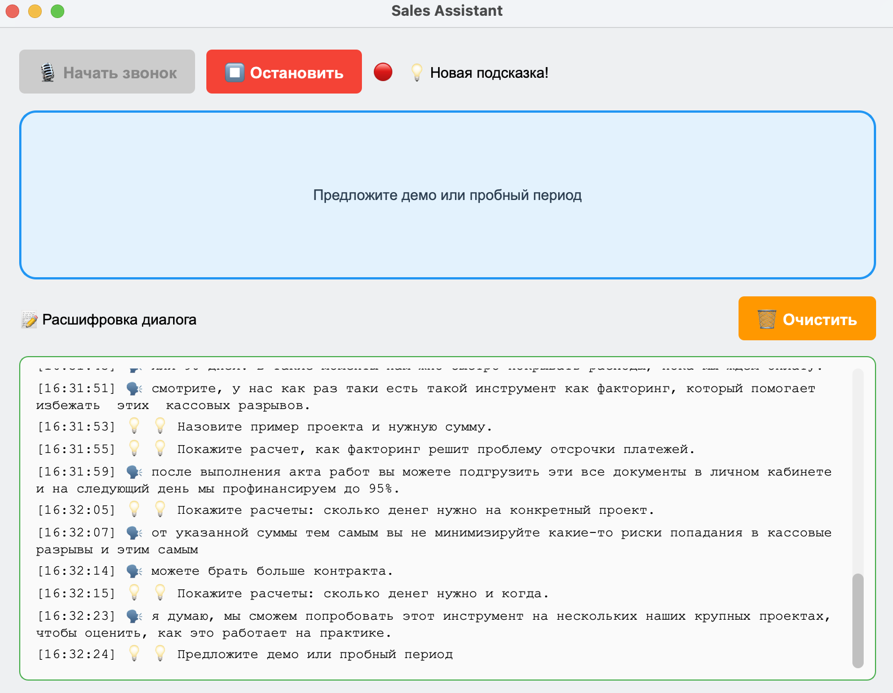

# Sales Assistant — Ассистент менеджера по продажам

Desktop-приложение для анализа телефонных переговоров в реальном времени. Распознаёт речь, анализирует диалог через LLM и выдаёт подсказки менеджеру.

## Стек

- **Python 3.12** + **PySide6** — desktop приложение
- **faster-whisper** — распознавание речи в реальном времени
- **Ollama** — локальная LLM (работает без интернета)
- **YAML** — гибкая конфигурация без изменения кода

## Системные требования

- macOS / Windows / Linux
- RAM: минимум 8 GB (рекомендуется 16 GB)
- Микрофон
- Ollama установлен локально
- GPU опционально — ускоряет Whisper и LLM

## Возможности

- **Распознавание речи** — `faster-whisper` (large-v3-turbo), русский язык
- **Анализ диалога** — локальная Ollama анализирует контекст и генерирует подсказки
- **Правила подсказок** — keyword matching из YAML-конфига, гибридный режим (правила + LLM)
- **Фильтр галлюцинаций** — паттерны, повторения, уверенность модели — всё настраивается
- **Логирование** — запись диалога и действий в файл и консоль
- **Горячие клавиши** — `F1` старт, `F2` стоп, `Ctrl+L` очистить лог

## Установка

### 1. Требования

- Python ≥ 3.12
- [Ollama](https://ollama.com) с моделью (например, `llama3.2:3b`)
- Микрофон

### 2. Клонирование и запуск

```sh
git clone https://github.com/Atsaev/sales-assistant.git
cd sales-assistant
uv sync
ollama pull gemma4:e4b
python main.py
```

Модель whisper (`large-v3-turbo`, ~1.5 GB) скачается автоматически при первом запуске.

## Структура проекта

```
sales-assistant/
├── main.py                         # Точка входа
├── app/
│   ├── configs/
│   │   ├── config_loader.py        # Загрузчик YAML + env vars
│   │   ├── app_config.yaml         # Настройки окна и GUI
│   │   ├── audio_config.yaml       # Настройки микрофона
│   │   ├── llm_config.yaml         # Провайдер LLM (Ollama/OpenAI)
│   │   ├── whisper_config.yaml     # Модель whisper и фильтры
│   │   ├── suggestions.yaml        # Правила подсказок
│   │   ├── prompts.yaml            # Системные промпты для LLM
│   │   └── styles_config.yaml      # Цвета и пути к QSS
│   ├── app_gui/
│   │   ├── main_window.py          # Главное окно
│   │   └── widgets/
│   │       ├── control_panel.py    # Кнопки управления
│   │       ├── log_widget.py       # Лог диалога
│   │       └── suggestion_widget.py # Отображение подсказок
│   ├── audio/
│   │   └── audio_capture.py        # Захват с микрофона
│   ├── workers/
│   │   ├── base_worker.py          # Базовый класс потоков
│   │   ├── whisper_worker.py       # Распознавание речи
│   │   └── llm_worker.py           # Анализ и подсказки
│   └── logs/
└── pyproject.toml
```

## Конфигурация

Все настройки в YAML-файлах в `app/configs/`. Основные:
```
| Файл                  | Что настраивает                                  |
| --------------------- | -------------------------------------------------|
|  llm_config.yaml      | Провайдер, модель, температура, интервал анализа |
|  whisper_config.yaml  | Модель whisper, фильтры галлюцинаций             |
|  suggestions.yaml     | Ключевые слова для rules, дефолтные подсказки    |
|  prompts.yaml         | Системный промпт для LLM                         |
|   audio_config.yaml   | Частота, длительность чанка                      |
```
## Процесс обработки

```
Микрофон → AudioCaptureThread (8s chunks)
                ↓ chunk_ready
         WhisperWorker (faster-whisper)
                ↓ text_ready
         LLMWorker (hybrid: rules → Ollama)
                ↓ suggestion_ready
         MainWindow → SuggestionWidget + LogWidget
```
## Демо



## Подсказки

Два уровня анализа (режим `hybrid`):

1. **Rules** — поиск ключевых слов (возражения, интерес, вопросы) из `suggestions.yaml`
2. **Ollama** — если keywords не сработали, отправляет контекст в локальную LLM

Если оба не дали результата — случайная фраза из пула дефолтов (25 вариантов, без повторов).
